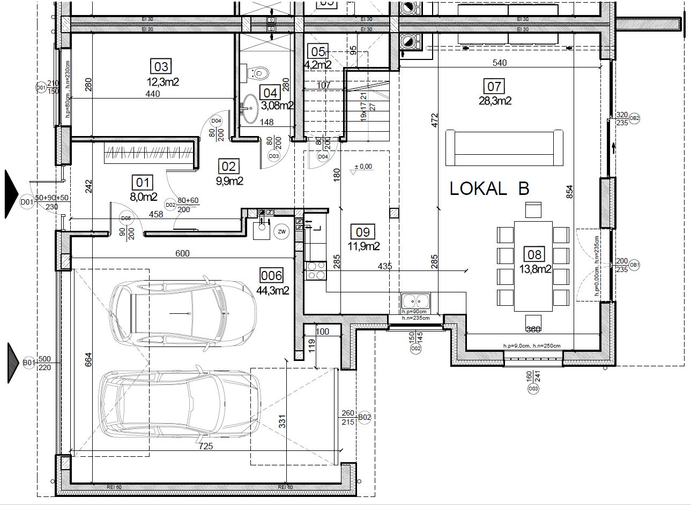

  
Nieruchomość stanowi dom jednorodzinny **dwulokalowy**. Do wyboru jeden z dwóch lokali, które są swoim lustrzanym odbiciem i oddzielone są ścianą przeciwpożarową. Lokale do sprzedaży z **niezależną** i ogrodzoną działką oraz dostępem do wszystkich mediów - prąd, gaz, woda oraz nowo wybudowana kanalizacja w ul. Sportowej.

# Lokalizacja

Nieruchomość położona na ul. **Sportowej**, miejscowość Zielonki Wieś, gmina Stare Babice. Bliskość do ul. Warszawskiej i ul. Sienkiewicza stanowi korzystną lokalizację zarówno dla celów dojazdu do centrum Warszawy (ul. Warszawska bezpośrednio łączy się z **drogą ekspresową S8**), jak i chęci wyjazdu wgłąb Polski. Dynamicznie rozwijająca się infrastruktura w okolicy i **nowa** droga asfaltowa ul. Sportowej ze ścieżką rowerową i chodnikiem gwarantuje uśmiech na twarzy mieszkańców.

# Informacje
Działka każdego z segmentów ma powierzchnię **470m2** w tym ok. 210m2 ogródka na tyłach domu. Powierzchnia jednego lokalu to ok. **250m2** obejmujących parter i piętro. **W cenie** zawiera się również ocieplone poddasze pod indywidualną aranżację. Osiągnięcie stanu deweloperskiego budynku nastąpi między II, a III kwartałem **2019r**. 

# Udogodnienia

* **30 lat** doświadczenia deweloperskiego na lokalnym rynku nieruchomości oraz współpraca ze zgranym zespołem specjalistów branżowych pozwoliły nam wykreować bryłę funkcjonalną i sprawdzoną. Układ niektórych pomieszczeń **pozwala** na wydzielenie dodatkowej łazienki/pralni, bądź pokoju/gabinetu.
*	Obszerny garaż **dwustanowiskowy** o pow. ok. 45m2 łączący wjazd na działkę z ogródkiem. Możliwość zaparkowania 4 samochodów osobowych na posesji.
*	Każdy z lokali wyposażono w taras o pow. ok. 20m2 zadaszony przez balkon o konstrukcji żelbetowej monolitycznej o pow. 15m2 **z dostępem** przez sypialnię oraz garderobę.
*	Pod schodami wyodrębniono **schowek/spiżarnię**, gdzie bez problemu wpasuje się dodatkowa lodówka, artykuły spożywcze lub inne rzeczy materialne.
*	Minimalizacja hałasu między Sąsiadami zapewniona przez **podwójną** ścianę wykonaną z pełnych bloczków silikatowych akustycznych gr. 18cm oddzielonych warstwą wełny akustycznej.
*	**Stan deweloperski** obejmuje: dach pokryty blachodachówką, tynki, wylewki, instalacja kominowa, okna, drzwi wejściowe, brama garażowa, instalacja elektryczna, hydrauliczna, wykończenie elewacji, ogrzewanie podłogowe, teren wyrównany i uporządkowany. Szczegółowy opis standardu dostępny na życzenie.  

# Rzuty kondygnacji
**_Rzut parteru dla lokalu A_**

**_Rzut piętra dla lokalu A_**

**_Rzut parteru dla lokalu B_**

**_Rzut piętra dla lokalu B_**

# Wizualizacja vs. Budowa

## LOKAL A

**_Wejście - Wiatrołap (Przedpokój)_**

**_Salon (Widok na klatkę schodową)_**

**_Salon (Widok na jadalnię)_**

**_Kuchnia (możliwa wyspa)_**

**_Łazienka na parterze_**

**_Łazienka master na piętrze_**

**_Łazienka dodatkowa na piętrze_**

#### Kontakt
Kacper Kowalewicz | Maciej Kowalewicz
----------------- | -----------------
 +48 723-601-906  |  +48 601-443-111
kacper.kowalewicz@gmail.com | maciej-kowalewicz@wp.pl

Rzuty kondygnacji, elewacja i PZT: **Pracownia Projektowa EURO**

Wizualizacja wnętrz: **EG Projekt Ewelina Golinowska**
